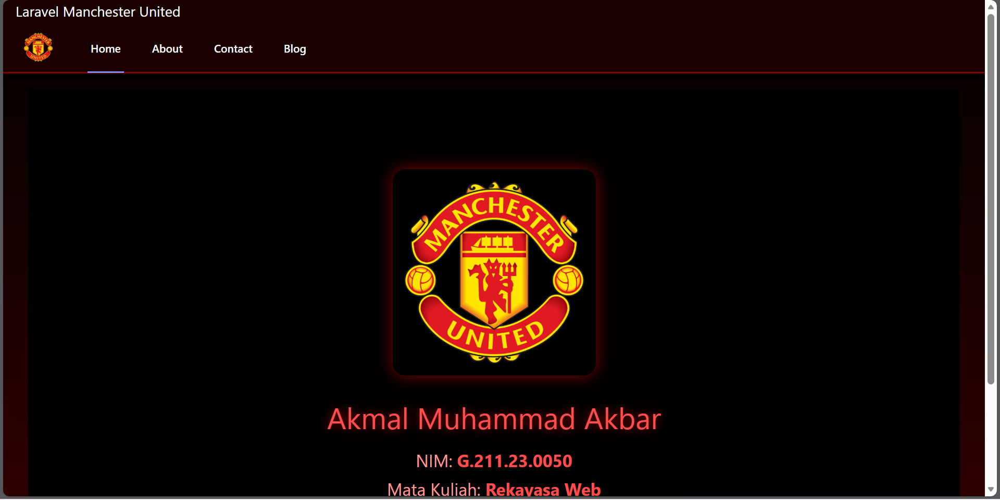
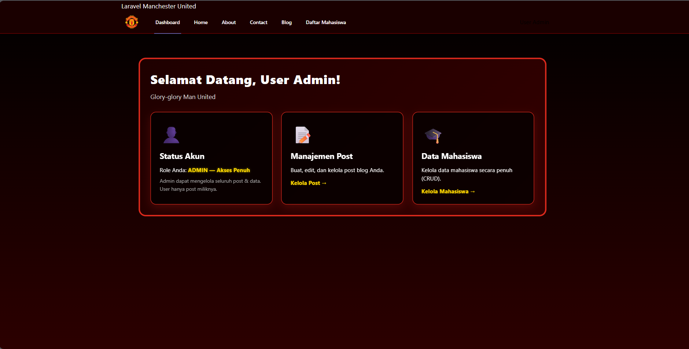
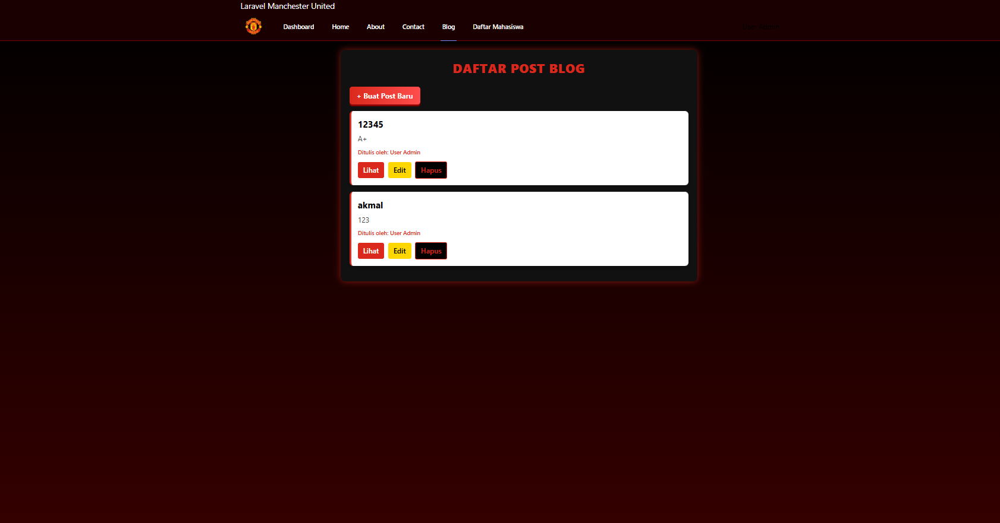
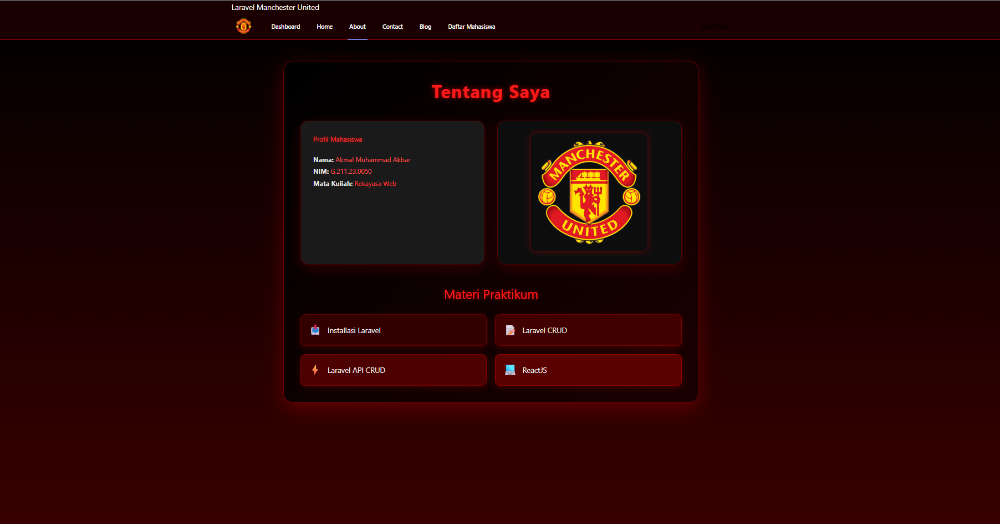

## ⚽ Laravel 12: Aplikasi Akademik & Blog Mahasiswa (Man. United Theme)

[](https://laravel.com/)
[](https://www.php.net/)
[](https://github.com/your-username)

Proyek ini adalah hasil implementasi dari serangkaian modul praktikum Pengembangan Web menggunakan **Laravel 12**. Aplikasi ini menampilkan fitur-fitur dasar Laravel MVC, CRUD data mahasiswa, sistem Blog terproteksi, dan implementasi API, dengan tema visual **Manchester United** (sesuai logo dan desain aplikasi).

---

### 💡 Fitur Utama & Tampilan Aplikasi

| Fitur | Deskripsi | Tampilan (File) |
| :--- | :--- | :--- |
| **Home Page** | Halaman *landing* sederhana yang menampilkan identitas mahasiswa. | [](sc/home.png) |
| **Dashboard Admin** | Halaman Admin dengan akses ke **Manajemen Post** dan **Data Mahasiswa (CRUD)**. | [](sc/dashboard.png) |
| **Data Mahasiswa** | Implementasi penuh **CRUD** untuk mengelola data akademik (`nama`, `nim`, `fakultas`). | [](sc/daftar.png) |
| **Sistem Blog** | Fitur Blog dasar (Create, Read, Update, Delete) yang dilindungi oleh **Laravel Policy (Authorization)**. | [](sc/blog.png) |
| **Profil & About** | Menampilkan identitas mahasiswa dan daftar materi praktikum yang telah dipelajari. | [](sc/about.png) |
| **Kontak** | Halaman informasi kontak pengguna. | [](sc/contact.png) |

---
### 📚 Modul Pembelajaran Utama yang Diimplementasikan

| Modul Pembelajaran | Konsep Kunci yang Diterapkan |
| :--- | :--- |
| **Dasar-dasar MVC** | Routing, Controller, **Blade Template** (Layout Inheritance, Partials). |
| **Database & ORM** | Migration (`mahasiswas`, `posts`), Seeder, dan Eloquent. |
| **Authentication & Authorization** | Sistem Login/Register, dan **Laravel Policy** untuk kontrol akses pada Post. |
| **RESTful API** | Pembuatan API Resource Controller dan endpoint `/api/posts` untuk JSON output. |
| **CRUD & Resources** | Penggunaan Resource Controller untuk efisiensi CRUD Data Mahasiswa dan Post. |

---
### 🧑‍💻 Tentang Proyek

Proyek ini dikerjakan oleh:

* **Nama:** Akmal Muhammad Akbar
* **NIM:** 6.211.23.0050
* **Mata Kuliah:** Rekayasa Web

**Glory-glory Man United!** 🔴⚫

---
### ⚙️ Persiapan & Instalasi Proyek

#### 1. Prasyarat

* **PHP** (8.2+), **Composer**
* **Database** (MySQL/MariaDB)

#### 2. Langkah Instalasi

```bash
# 1. Clone Repository
git clone [URL_REPOSITORY_ANDA]
cd [NAMA_FOLDER_PROJECT]

# 2. Instal Dependensi PHP
composer install

# 3. Konfigurasi Environment
cp .env.example .env
php artisan key:generate
# --- Edit file .env dan atur koneksi DB Anda (DB_DATABASE, DB_USERNAME, DB_PASSWORD) ---

# 4. Jalankan Migration (Membuat tabel users, posts, mahasiswas)
php artisan migrate

# 5. Instal Dependensi Frontend (Opsional, jika menggunakan Vite/Mix)
# npm install && npm run dev

# 6. Jalankan Server
php artisan serve
---

Aplikasi dapat diakses di `http://127.0.0.1:8000/`.
